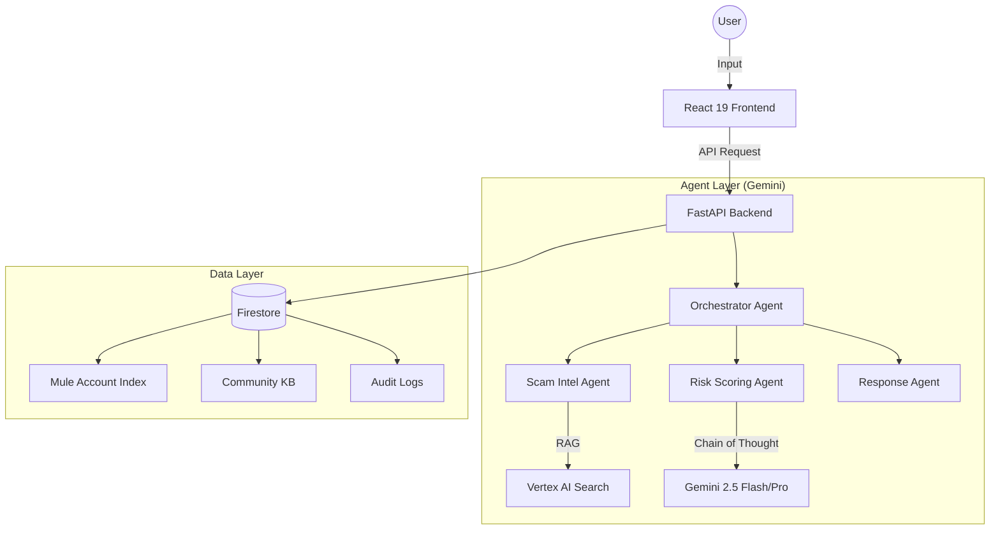

# ScamSentinel MY

**Real-time financial fraud detection and community intelligence for Malaysia.**

ScamSentinel MY is an AI-powered platform designed to protect Malaysian citizens from the rising tide of digital scams. By leveraging the latest Gemini models and real-time community data, ScamSentinel provides instant risk assessment for suspicious messages, links, QR codes, and more.

## 🚀 Features

- **Unified Threat Scan**: Analyse SMS text, URLs, QR codes, and voice recordings in one place.
- **Transaction Intercept**: Verify bank accounts, phone numbers, or e-wallet IDs against a curated mule account database before making payments.
- **PDRM Report Generator**: Automatically generate a pre-filled report template for HIGH-risk threats to streamline reporting to the authorities.
- **Live Community Intelligence**: A real-time feed of reported scam patterns across Malaysia, powered by Firestore.
- **Privacy First**: Built-in PII anonymiser ensures that community data is safe and strictly follows privacy regulations.

## 🛠️ Architecture



## 💻 Tech Stack

- **Frontend**: React 19, Vite, Tailwind CSS v4, Chart.js.
- **Backend**: FastAPI (Python 3.12), Pydantic v2.
- **AI**: Gemini 2.5 Flash/Pro, Vertex AI Search (RAG).
- **Database**: Google Cloud Firestore, Firebase Auth.
- **DevOps**: Docker, Google Cloud Run, GitHub Actions.

## 🛠️ Local Setup

### Backend
1. Install dependencies:
   ```bash
   pip install -r requirements.txt
   ```
2. Configure environment variables in `.env`.
3. Run the server:
   ```bash
   uvicorn src.main:app --port 8080
   ```

### Frontend
1. Install dependencies:
   ```bash
   cd frontend
   npm install
   ```
2. Run the development server:
   ```bash
   npm run dev
   ```

## 📄 License
This project is developed for the **Project 2030 Hackathon — Track 5: Secure Digital**.

---
*ScamSentinel MY — Protecting your wealth, one scan at a time.*
