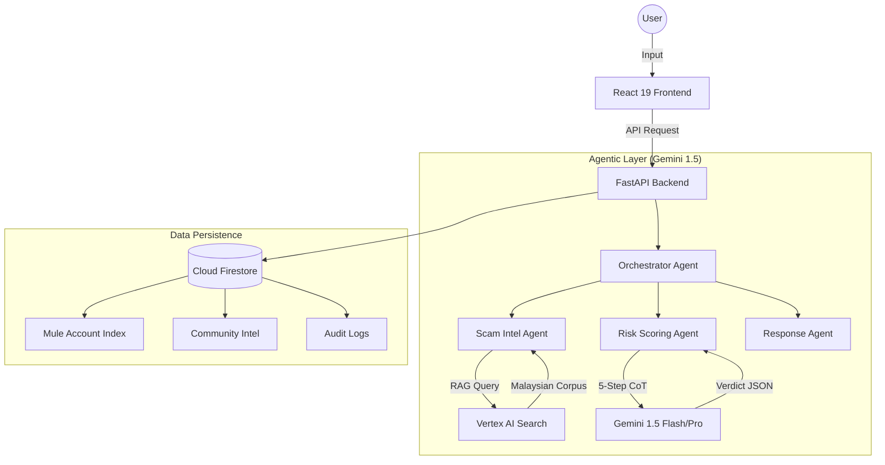

# 🛡️ ScamSentinel MY
**Real-time Financial Fraud Detection & Community Intelligence for Malaysia**

[](https://project2030.my)
[]()
[]()

ScamSentinel MY is an advanced, agentic AI platform designed to combat the rising tide of digital fraud in Malaysia. By combining **Gemini 1.5's reasoning capabilities** with **Real-time RAG (Retrieval-Augmented Generation)** and **Community Intelligence**, ScamSentinel provides a tactical "command center" for citizens to verify and report threats instantly.

---

## 🎯 The Mission
In 2024, Malaysians lost over RM1.3 billion to online scams. Most victims fall prey because they lack a quick, authoritative way to verify suspicious messages or bank accounts. **ScamSentinel MY** fills this gap by providing an instant, AI-driven second opinion that matches patterns against official PDRM, BNM, and MCMC data.

---

## ✨ Key Features

### 🔍 1. Unified Threat Scanner
An all-in-one analysis engine for diverse payloads:
- **SMS & Text Messages**: Detect social engineering and phishing lures.
- **Suspicious URLs**: Real-time scanning for credential harvesting and malware.
- **QR Codes**: Verify destination safety before you interact.
- **Voice Analysis**: (Beta) Real-time transcription and threat detection for scam calls using Gemini Live.

### 🏦 2. Transaction Vault (Intercept)
A proactive defense layer for financial transactions. Verify:
- **Bank Account Numbers**
- **Phone Numbers**
- **E-Wallet IDs**
Against a curated, real-time database of confirmed mule accounts.

### 📑 3. PDRM Report Generator
For **HIGH-risk** detections, ScamSentinel automatically generates a structured report template based on the analysis, making it easier for victims to file a report with the **PDRM Commercial Crime Investigation Department (CCID)**.

### 🌐 4. Live Intel Feed
A decentralized community knowledge base. When a threat is detected, it is anonymized and pushed to a live feed, allowing other users to see active scam patterns in their region in real-time.

---

## 🏗️ System Architecture

ScamSentinel uses a sophisticated **Agentic Pipeline** to ensure accuracy and reduce hallucinations:



### The 5-Step Reasoning Trace
The **Risk Scoring Agent** doesn't just guess. It follows a mandatory 5-step Chain-of-Thought:
1.  **Classify**: Identify the scam type (Phishing, Mule Account, Romance, etc.)
2.  **Match Intelligence**: Compare the payload against RAG results from official PDRM/BNM bulletins.
3.  **Score**: Assign a risk score (0-100) based on weighted indicators.
4.  **Explain**: Translate technical findings into plain-language English/Bahasa for the citizen.
5.  **Output**: Produce a strictly typed JSON verdict for the frontend.

---

## 🛠️ Technology Stack

| Component | Technology | Why? |
| :--- | :--- | :--- |
| **Language** | Python 3.12 | Industry standard for AI/ML pipelines. |
| **Backend** | FastAPI | High performance, asynchronous, and Pydantic-driven. |
| **Frontend** | React 19 + Tailwind v4 | Premium, responsive, and tactical dark-mode UI. |
| **AI Reasoning** | Gemini 1.5 Flash | High speed and exceptional JSON schema following. |
| **Intelligence** | Vertex AI Search | Enterprise-grade RAG over a 1000+ document corpus. |
| **Database** | Firestore | Real-time listeners for the live Intel Feed. |

---

## 🚀 Local Development

### 1. Prerequisites
- Python 3.12+
- Node.js 18+
- Google Cloud Service Account Key

### 2. Environment Variables
Create a `.env` file in the root:
```env
GEMINI_API_KEY=your_key
FIREBASE_SA_PATH=service_account_key.json
GCP_PROJECT=scamsentinel-my
VERTEX_SEARCH_DATASTORE_ID=scamsentinel-corpus
```

### 3. Backend Setup
```bash
pip install -r requirements.txt
uvicorn src.main:app --port 8080
```

### 4. Frontend Setup
```bash
cd frontend
npm install
npm run dev
```

---

## 🛡️ Privacy & Ethics
- **PII Stripping**: All community-shared data is automatically anonymized using the Response Agent.
- **Transparency**: Every verdict includes a "Reasoning Trace" explaining exactly why the AI reached its conclusion.
- **Authority-Aligned**: Data stores are matched against official Malaysian government advisories to ensure accuracy.

---

## 🏆 Project 2030 Hackathon
This project was built for **Track 5: Secure Digital**, focusing on strengthening digital trust and safety for all Malaysians.


Prototype Link : https://scamsentinel-my.web.app
---
*ScamSentinel MY — Protecting your wealth, one scan at a time.*
